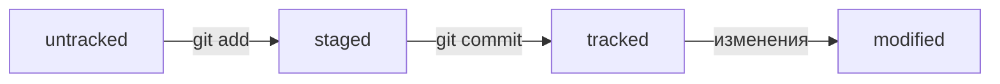

# **Шпаргалка по Git**
---

## **Навигация**

* `pw`- покажи, в какой я папке;

* `ls`- покажи файлы и папки в текущей папке;

* `ls -a`-  покажи также скрытые файлы и папки, названия которых начинаются с символа `.`;

* `cd`- перейди в папку;

* `cd ..`- перейди на уровень выше, в родительскую папку;

* `cd ~`- перейди в домашнюю директорию;

* `cd /`- перейди в корневую директорию.

## **Работа с файлами**

### **Создание**
* `touch`- создай файл в текущей папке;

* `mkdir`— создай папку с именем в текущей папке.

### **Копирование и перемещение**

* `cp`-скопируй файл в другое место;

* `mv`-перемести файл или папку в другое место.


### **Чтение**

* `cat`-распечатай содержимое текстового файла file.txt.

### **Удаление**

* `rm`-удали файл;

* `rmdir`-удали папку;

* `rm -r`-удали папку и всё, что она содержит.

### **Как исправить коммит**

* `--amend` рассчитан на работу с последним коммитом `(HEAD)`.
* Дополнить коммит новыми файлами можно с помощью `git commit --amend --no-edit`. Благодаря опции `--no-edit` сообщение к коммиту останется таким, каким и было.
*Изменить сообщение к коммиту позволяет команда `git commit --amend -m "Обновлённое сообщение коммита"`.

### **Как откатиться**

* Команда `git restore --staged <file>` переведёт файл из `staged` обратно в `modified` или `untracked`.
* Команда `git reset --hard <commit hash>` «откатит» историю до коммита с хешем `<hash>`. Более поздние коммиты потеряются!
* Команда `git restore <file>` «откатит» изменения в файле до последней сохранённой (в коммите или в `staging`) версии.

### **Жизненный цикл файлов**

* `untracked` -файл, о существовании которого Git знает, но не следит за изменениями в нём;

* `tracked` -файл, о существовании которого Git знает и следит за изменениями в нём;

* `staged` -файл готовый к коммиту;

* `modified` -файл был изменен;

* При любом изменении файла `tracked` он становится `modified` ,но при этом остается `tracked`.


---

### **Как сделать mermaid-схему**

Чтобы получить `mermaid`-схему в `README.md`, нужно добавить блок кода типа `mermaid`.

* Блоки кода в маркдауне начинаются и заканчиваются тремя символами ` ``` `. После первых трёх ` ``` ` можно указать, какой именно код будет внутри блока. Например: ` ```mermaid` , ` ```bash`, ` ```python`, ` ```javascript` и так далее. Если ничего не указать, GitHub будет считать весь код простым текстом.
* Чтобы сделать схему, нужно указать формат: `graph LR`. Graph — это простейший тип схем.
* Чтобы добавить элементы и связи (стрелки), используют строки вида `A --> B`. Такая строка создаст квадратные блоки `А` и `B` и соединит их стрелкой.


