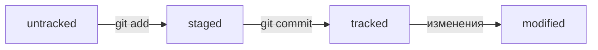

# **Шпаргалка по Git**
---

## **Навигация**

* `pw`- покажи, в какой я папке;

* `ls`- покажи файлы и папки в текущей папке;

* `ls -a`-  покажи также скрытые файлы и папки, названия которых начинаются с символа `.`;

* `cd`- перейди в папку;

* `cd ..`- перейди на уровень выше, в родительскую папку;

* `cd ~`- перейди в домашнюю директорию;

* `cd /`- перейди в корневую директорию.

## **Работа с файлами**

### **Создание**
* `touch`- создай файл в текущей папке;

* `mkdir`— создай папку с именем в текущей папке.

### **Копирование и перемещение**

* `cp`-скопируй файл в другое место;

* `mv`-перемести файл или папку в другое место.


### **Чтение**

* `cat`-распечатай содержимое текстового файла file.txt.

### **Удаление**

* `rm`-удали файл;

* `rmdir`-удали папку;

* `rm -r`-удали папку и всё, что она содержит.

### **Игнорирование**

* Если нужно, чтобы Git игнорировал какие-то файлы, стоит составить файл `.gitignore`.
* Посмотреть, что игнорируется, можно с помощью команды `git status --ignored`.
* Сам файл `.gitignore` — это обычный файл в репозитории. Его тоже стоит закоммитить.

### **Инициализация репозитория**
* `git init` — инициализируй репозиторий.

### **Синхронизация локального и удалённого репозиториев**
* `git remote add origin https://github.com/YandexPracticum/first-project.git` — привяжи локальный репозиторий к удалённому с URL 
* `https://github.com/YandexPracticum/first-project.git`;
* `git remote -v` — проверь, что репозитории действительно связались;
* `git push -u origin main` — в первый раз загрузи все коммиты из локального репозитория в удалённый с названием `origin`.
* `git push` — загрузи коммиты в удалённый репозиторий после того, как он был привязан с помощью флага `-u`.

### **Подготовка файла к коммиту**
* `git add todo.txt` — подготовь файл todo.txt к коммиту;
* `git add --all` — подготовь к коммиту сразу все файлы, в которых были изменения, и все новые файлы;
* `git add .` — подготовь к коммиту текущую папку и все файлы в ней.

### **Создание и публикация коммита**
* `git commit -m "Комментарий к коммиту."` — сделай коммит и оставь комментарий, чтобы было проще понять, какие изменения сделаны;
* `git push` — добавь изменения в удалённый репозиторий.

### **Просмотр информации о коммитах**
* `git log`— выведи подробную историю коммитов;
* `git log --oneline`— покажи краткую информацию о коммитах: сокращённый хеш и сообщение.

### **Просмотр состояния файлов**
* `git status` — покажи текущее состояние репозитория.

### **Добавление изменений в последний коммит**
* `git commit --amend --no-edit` — добавь изменения к последнему коммиту и оставь сообщение прежним;
* `git commit --amend -m "Новое сообщение"` — измени сообщение к последнему коммиту на Новое сообщение.

### *Выйти из редактора `Vim`: нажать `Esc`, ввести `:qa!`, нажать `Enter`.*

### **«Откат» файлов и коммитов**
* `git restore --staged hello.txt` — переведи файл hello.txt из состояния `staged` обратно в `untracked` или `modified`;
* `git restore hello.txt` — верни файл hello.txt к последней версии, которая была сохранена через `git commit` или `git add`;
* `git reset --hard b576d89` — удали все незакоммиченные изменения из `staging` и «рабочей зоны» вплоть до указанного коммита.

### **Просмотр изменений**
* `git diff` — покажи изменения в «рабочей зоне», то есть в `modified`-файлах;
* `git diff a9928ab 11bada1` — выведи разницу между двумя коммитами;
* `git diff --staged` — покажи изменения, которые добавлены в `staged`-файлах.

## *Работа с ветками*

### *Клонирование чужого репозитория*
* `git clone git@github.com:YandexPraktikum/first-project.git` — склонируй репозиторий с URL `first-project.git` из аккаунта YandexPraktikum на мой локальный компьютер.

### *Создание веток*
* `git branch feature/the-finest-branch` — создай ветку от текущей с названием `feature/the-finest-branch`;
* `git checkout -b feature/the-finest-branch` — создай ветку `feature/the-finest-branch` и сразу переключись на неё.

### *Навигация по веткам*
* `git branch` — покажи, какие есть ветки в репозитории и в какой из них я нахожусь (текущая ветка будет отмечена символом `*`);
* `git branch -a` — покажи все известные ветки, как локальные (в локальном репозитории), так и удалённые (в `origin`, или на `GitHub`).
* `git checkout feature/br` — переключись на ветку `feature/br`.

### *Сравнение веток*
* `git diff main HEAD` — покажи разницу между веткой `main` и указателем на `HEAD`;
* `git diff HEAD~2 HEAD` — покажи разницу между тем коммитом, который был два коммита назад, и текущим.

### *Удаление веток*
* `git branch -d br-name` — удали ветку `br-name`, но только если она является частью `main`;
* `git branch -D br-name` — удали ветку `br-name`, даже если она не объединена с `main`.

### *Слияние веток*
* `git merge main` — объедини ветку main с текущей активной веткой. 

### *Работа с удалённым репозиторием*
* `git push -u origin my-branch` — отправь новую ветку `my-branch` в удалённый репозиторий и свяжи локальную ветку с удалённой, чтобы при ### дополнительных коммитах можно было писать просто `git push` без `-u`;
* `git push my-branch` — отправь дополнительные изменения в ветку `my-branch`, которая уже существует в удалённом репозитории;
* `git pull` — подтяни изменения текущей ветки из удалённого репозитория.


### **Жизненный цикл файлов**

* `untracked` -файл, о существовании которого Git знает, но не следит за изменениями в нём;

* `tracked` -файл, о существовании которого Git знает и следит за изменениями в нём;

* `staged` -файл готовый к коммиту;

* `modified` -файл был изменен;

* При любом изменении файла `tracked` он становится `modified` ,но при этом остается `tracked`.


---

### **Как сделать mermaid-схему**

Чтобы получить `mermaid`-схему в `README.md`, нужно добавить блок кода типа `mermaid`.

* Блоки кода в маркдауне начинаются и заканчиваются тремя символами ` ``` `. После первых трёх ` ``` ` можно указать, какой именно код будет внутри блока. Например: ` ```mermaid` , ` ```bash`, ` ```python`, ` ```javascript` и так далее. Если ничего не указать, GitHub будет считать весь код простым текстом.
* Чтобы сделать схему, нужно указать формат: `graph LR`. Graph — это простейший тип схем.
* Чтобы добавить элементы и связи (стрелки), используют строки вида `A --> B`. Такая строка создаст квадратные блоки `А` и `B` и соединит их стрелкой.

### **Feature branch workflow**
Самый популярный подход к работе с `Git` в команде — это feature branch workflow. В нём создают ветку для каждой задачи (например, для новой функциональности или исправления бага), а когда всё готово, вливают новую ветку в `main`.  

Важные этапы этого процесса — пул-реквест и ревью изменений. Пул-реквест — это интерфейс, в котором можно обсудить изменения. Ревью — просмотр изменений другими участниками и один из способов проверить качество таких изменений.  

Если вы уже участник проекта (или collaborator в терминах GitHub), можно клонировать репозиторий напрямую. А если нет, нужно предварительно сделать «форк». Также для участников доступна кнопка `Merge` после ревью, а для неучастников — нет.

### **Конфликты слияния**
Когда один и тот же файл меняется в нескольких ветках, при их слиянии может произойти конфликт. Пугаться конфликтов не нужно, это нормальная часть работы с системами контроля версий. IDE, вроде VSCode или Intellij IDEA, помогут «склеить» файл из двух конфликтующих версий.

### **Алгоритм-шпаргалка для создания PR**
1. Склонировать репозиторий.  
	1.1 Если вы не участник проекта, предварительно сделать «форк» исходного репозитория.  
	1.2 На странице репозитория или «форка» нажать кнопки: **Code → SSH → скопировать ссылку**.  
	1.3 Выполнить команду `git clone <ссылка на репозиторий>`.
2. Создать ветку для вашей задачи: `git checkout -b my-task-branch-name`.
3. Добавить и «закоммитить» изменения, которые вы хотите внести в проект.
4. «Запушить» ветку: `git push --set-upstream origin HEAD` или `git push -u origin my-task-branch-name`.  
	4.1 GitHub (с помощью Git) выведет ссылку на создание PR. По ней нужно перейти.  
	4.2 PR можно также создать через интерфейс GitHub.  
5. Сообщить о пул-реквесте ревьюеру.  
	5.1 Иногда ревьюеры назначаются автоматически, тогда сообщать не нужно.
6. Обсуждать с ревьюером предлагаемые изменения и вносить правки, пока эти изменения не будут одобрены (пока не будет получен «апрув»).  
	6.1. Если кто-то добавил конфликтующие изменения в main, пока ваш PR был на ревью, нужно разрешить конфликт:    
* Обновить `main`: `git checkout main && git pull`.  
* Влить `main` в свою ветку: `git checkout my-task-branch-name && git merge main`.  
* Разрешить конфликты слияния с помощью IDE или вручную.  
* Создать коммит слияния: `git commit --no-edit` или `git commit -m 'merge main'.  
* Сделать `git push` своей ветки.  
7. Нажать кнопку **Merge** или подождать, пока её нажмёт кто-то ещё.
8. Ещё раз обновить `main`, чтобы «подтянуть» ваши изменения в основную ветку локального репозитория: `git checkout main && git pull`.

### **Алгоритм-шпаргалка для разрешения конфликтов слияния**  
1. Открыть проект в IDE (VS Code, IDEA или другие).  
2. Открыть файл, в котором есть **конфликт**.  
3. Выбрать, какие части файла нужно взять из одной ветки, а какие — из другой.  
4. Когда конфликты разрешены, сделать коммит: `git commit --no-edit` или `git commit -m 'merge branch <название ветки>'.


